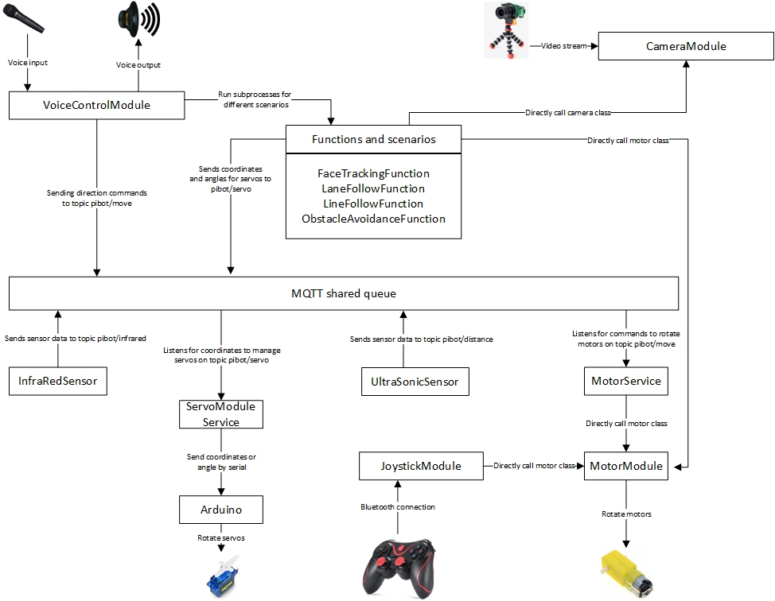

Video of working car
https://www.youtube.com/watch?v=Jpvy2N1J_lg 

# robocar
Repo for robotic car

For joystick

https://pimylifeup.com/raspberry-pi-playstation-controllers/

https://github.com/sgmoorthy/PS3RasPiRobot

sudo apt-get -y install jd

sudo apt-get install libusb-dev joystick python-pygame -y

mkdir ~/sixpair

cd ~/sixpair

wget http://www.pabr.org/sixlinux/sixpair.c

gcc -o sixpair sixpair.c -lusb

With Sixpair now compiled on our Raspberry Pi, we need to plug our PS3 Controller into the Raspberry Pi using the USB mini cable.
Once the controller has been plugged in, we can run sixpair by running the command below.
Sixpair will re-configure the controller so that it will talk with our Bluetooth device.

sudo ~/sixpair/sixpair

sudo bluetoothctl

Result screen
[NEW] Controller B8:27:EB:CB:33:9C raspberrypi [default]
[NEW] Device CC:B1:1A:DA:B5:F1 [TV] Samsung 5 Series (32)
[NEW] Device A3:2B:4D:7F:2F:A7 PLAYSTATION(R)3 Controller

[bluetooth]# discoverable on
Changing discoverable on succeeded
[CHG] Controller A3:2B:4D:7F:2F:A7 Discoverable: yes

[bluetooth]# agent on
Agent registered
Type trust command on the identified device code on [bluetooth]#
trust A3:2B:4D:7F:2F:A7
Result [CHG] Device A3:2B:4D:7F:2F:A7 Trusted: yes 
Changing A3:2B:4D:7F:2F:A7 
trust succeeded [CHG] Device A3:2B:4D:7F:2F:A7 Connected: yes

----------------------
Raspbian GNU/Linux 11 (bullseye) 32 bit
pip3 install -r requirements.txt

sudo apt-get install libportaudio0 libportaudio2 libportaudiocpp0 portaudio19-dev

sudo apt-get install python-dev

pip3 install setuptools

sudo python3 setup.py install

sudo apt-get install flac

sudo apt install python3-gst-1.0

